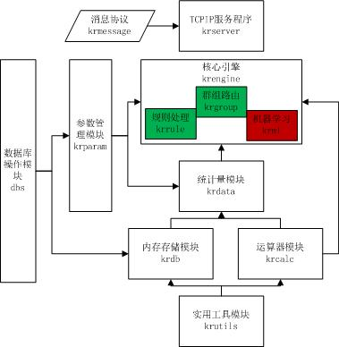

# 项目简介

[krproject](https://github.com/abstiger/krproject) ，是一个基于规则的实时流数据分析引擎！  

## 模块结构

::: center

:::

## 规则编辑

::: center

:::

## 开发进展

1. [krproject开发进展（一）](./krproject-develop-trace-1.md)        2012/04/07        设计规划krproject
1. [krproject开发进展（二）](./krproject-develop-trace-2.md)        2012/04/28        表达式引擎计算器开发
1. [krproject开发进展（三）](./krproject-develop-trace-3.md)        2012/06/16        框架开发初步完成
1. [krproject开发进展（四）](./krproject-develop-trace-4.md)        2012/10/20        代码开源至github，整理介绍ppt
1. [krproject开发进展（五）](./krproject-develop-trace-5.md)        2012/11/24        回应challenge，数据库操作改用rapodbc
1. [krproject开发进展（六）](./krproject-develop-trace-6.md)        2013/02/06        压力测试，单机QPS为4~5万
1. [krproject开发进展（七）](./krproject-develop-trace-7.md)        2013/02/26        krweb开发，计算引擎表达式改为json格式
1. [krproject开发进展（八）](./krproject-develop-trace-8.md)        2013/04/22        krweb核心json格式规则编辑器完成
1. [krproject开发进展（九）](./krproject-develop-trace-9.md)        2013/06/01        playweibo前台初步开发与后台server打通
1. [krproject开发进展（十）](./krproject-develop-trace-10.md)        2013/06/29       共享内存改为动态内存，swig生成Java接口
1. [krproject开发进展（十一）](./krproject-develop-trace-11.md)      2013/12/08       代码结构重构，krweb开发
1. [krproject开发进展（十二）](./krproject-develop-trace-12.md)      2013/12/22       krproject首秀记录
1. [krproject开发进展（十三）](./krproject-develop-trace-13.md)      2014/01/22       krclient与krshell开发完成
1. [krproject开发进展（十四）](./krproject-develop-trace-14.md)      2014/04/19       kriface接口生成的调研及开发
1. [krproject开发进展（十五）](./krproject-develop-trace-15.md)      2015/05/01       krflow引入的设计考虑

